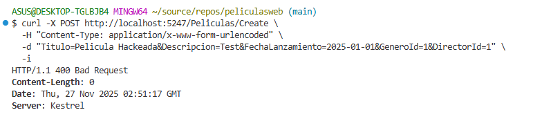
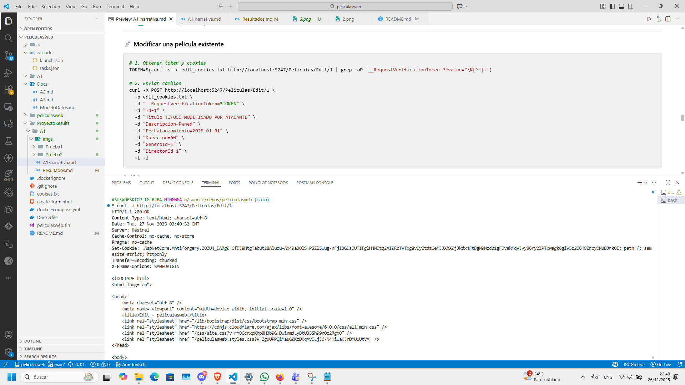
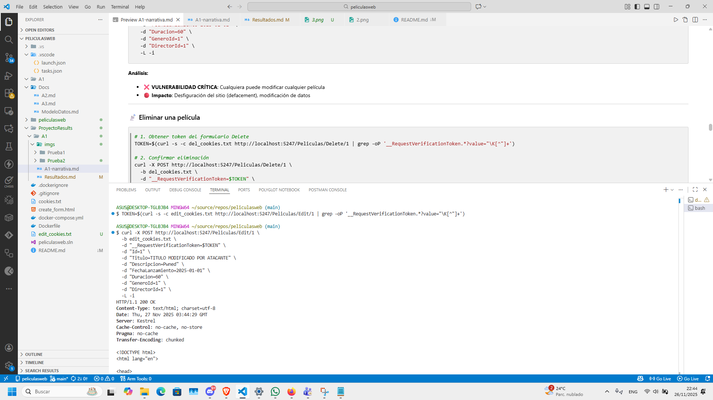
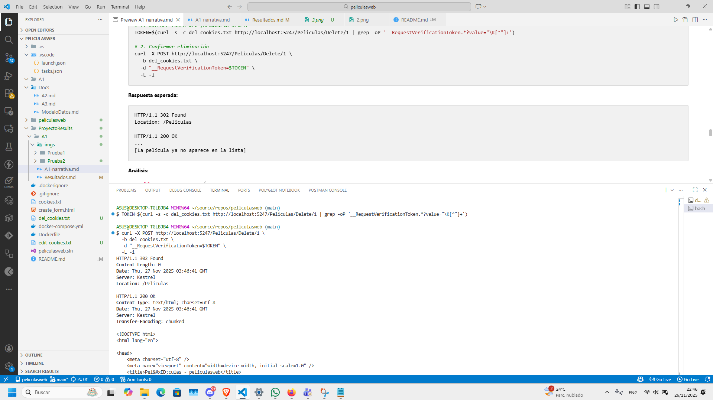
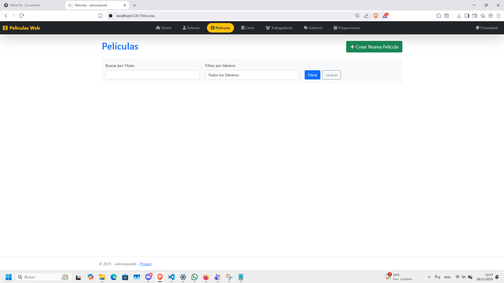
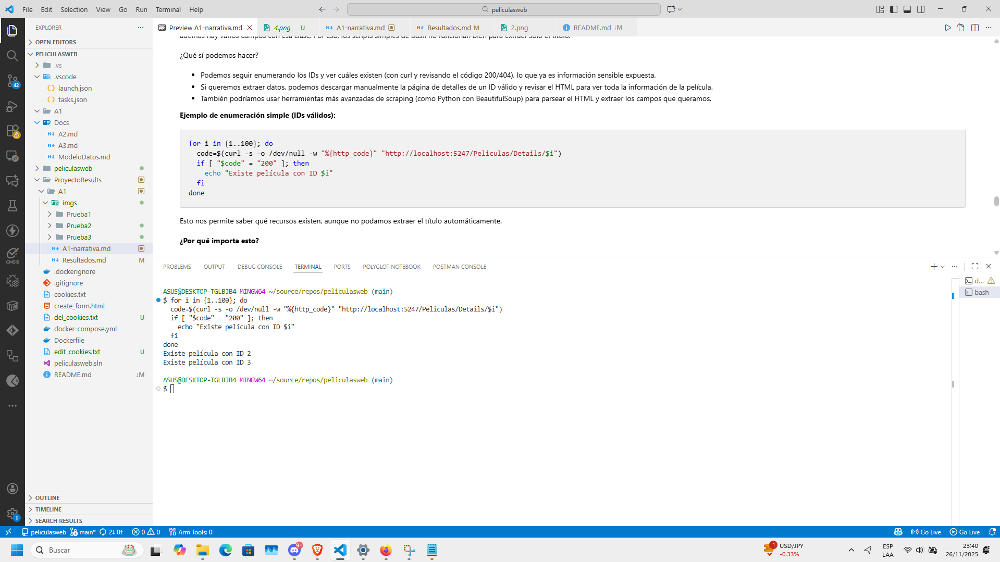

# A1 BROKEN ACCESS CONTROL

👉 [Volver a la narrativa y explicación de pruebas](A1-narrativa.md)

La limitación acá es que no tenemos una forma de hacer login/register directamente.
Aquí analizaremos diferentes pruebas:

- Enumeración de recursos (Insecure Direct Object Reference - IDOR)
- Acceso sin autenticación a operaciones críticas
- Manipulación y eliminación de recursos
- Ataque automatizado de enumeración

---

## Prueba 1: Enumeración de recursos

Ejecutamos un curl para analizar qué tipo de datos nos entrega y observamos que nos devuelve:


Los siguientes headers:

```
HTTP/1.1 200 OK
Content-Type: text/html; charset=utf-8
Date: Thu, 27 Nov 2025 01:57:24 GMT
Server: Kestrel
Transfer-Encoding: chunked
```

¿Qué sucede o qué implica que podamos acceder directamente al id de una película? Puesto que no tenemos directamente un login o register, aún puede ser vulnerable esta app. Al ejecutar un comando de consola que repita estos llamados a diferentes ids, tenemos que los ids válidos tienen una respuesta de 200 y los no válidos o que no existan un 404.


Ahora si observamos que si buscamos un id que no existe realmente no afecta a la página porque devuelve un 404, entonces evitamos que se cruce información de los otros ids, lo cual demuestra una buena prueba de seguridad.


El análisis revela que, aunque el servidor maneja correctamente los recursos inexistentes devolviendo un código 404 y no se observa revelación directa de información sensible en los mensajes de error, existe una vulnerabilidad y es que es posible enumerar todas las películas existentes a través de los códigos de respuesta del servidor (200 para existentes y 404 para inexistentes). Esto permite a un atacante identificar todos los IDs válidos y acceder a recursos sin autorización, lo que representa un riesgo de seguridad significativo. Para mitigar este problema, es fundamental implementar autenticación y validar que los usuarios tengan permiso para acceder a cada recurso.

---

## Prueba 2

Vamos a intentar romper o acceder a la página con el create, vemos que nos envía un ok pero ahora tenemos la cookie entera, es decir si existiese una autenticación capaz un jwt el token quedaría expuesto también.


Ahora si le queremos enviar algo más denso vamos a ver que no nos permite así queramos meter directamente el propio header y sus datos.



Entonces proponemos lo siguiente: enviar al post con un CSRF válido.


---

## Prueba 3: Modificar y eliminar películas sin restricción

Ahora seguimos con la parte de modificar y eliminar películas, porque si ya pudimos crear, ¿por qué no probar si también podemos cambiar o borrar lo que ya existe? Así que nos lanzamos con los comandos y a ver qué pasa.

Primero, ejecutamos el curl para editar una película. Todo normal, la petición pasa y no hay que ser admin ni nada. Aquí la evidencia:



Después, mandamos los dos comandos: uno para modificar los datos de la película y otro para eliminarla. Todo sin trabas, como si fuéramos dueños del sitio. Aquí se ve el proceso:



Luego, ejecutamos el comando para eliminar la película. Igual, sin ningún tipo de validación ni freno. Así de fácil:



Y para cerrar, revisamos la página web y ya no aparece la película. Confirmado visualmente que la eliminación fue exitosa y cualquiera puede hacerlo si sabe el ID. Aquí la prueba final:



En resumen, modificar y eliminar recursos está igual de expuesto que crear. Sin autenticación ni permisos, cualquiera puede hacer y deshacer a gusto.

---

## Prueba 4: Enumeración de recursos (IDs válidos)

Para cerrar, intentamos automatizar la enumeración de películas usando scripts, pero por cómo está hecho el HTML no fue tan directo sacar los títulos. Sin embargo, sí pudimos comprobar que es posible saber qué IDs existen usando un comando sencillo que revisa el código de respuesta del servidor.

Aquí la evidencia visual de la ejecución del script y el resultado:



Aun sin todos los títulos de golpe, ya con saber qué recursos existen sin ninguna restricción es suficiente para demostrar la vulnerabilidad. Si alguien quisiera, podría ir uno por uno y sacar toda la info manualmente.
En resumen: seguimos la guía, probamos la enumeración y confirmamos que la app deja ver qué películas existen solo con saber el ID. Otra vez, acceso sin control.

## 🛠️ Soluciones propuestas

Después de analizar todas las pruebas y vulnerabilidades, estas son las soluciones recomendadas para corregir el Broken Access Control:

- **Implementar autenticación:** Que solo usuarios registrados puedan crear, editar o eliminar películas. Usar `[Authorize]` en los controladores.
- **Control de roles:** Definir roles como Admin o Editor para limitar quién puede modificar o eliminar recursos críticos.
- **Validar propiedad de recursos:** Asegurarse de que solo el creador de una película pueda editarla o eliminarla, usando el identificador del usuario.

Ejemplo de cómo se vería en el código:

```csharp
[Authorize]
public class PeliculasController : Controller
{
	[AllowAnonymous]
	public async Task<IActionResult> Index() { ... }

	[AllowAnonymous]
	public async Task<IActionResult> Details(int? id) { ... }

	[Authorize(Roles = "Admin,Editor")]
	public async Task<IActionResult> Edit(int id) { ... }

	[Authorize(Roles = "Admin")]
	public async Task<IActionResult> Delete(int id) { ... }
}
```

Y para validar la propiedad:

```csharp
[Authorize]
public async Task<IActionResult> Edit(int id)
{
	var pelicula = await _context.Peliculas.FindAsync(id);
	if (pelicula.CreadorId != User.FindFirstValue(ClaimTypes.NameIdentifier))
	{
		return Forbid();
	}
	return View(pelicula);
}
```

Con estas medidas, se mitiga el riesgo de acceso no autorizado y se protege la integridad de la aplicación.
