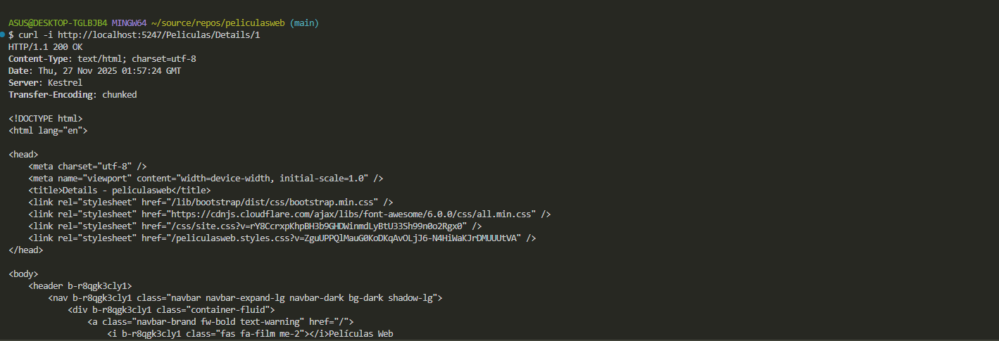
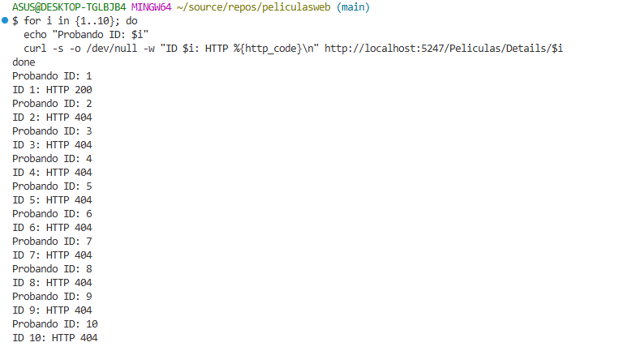
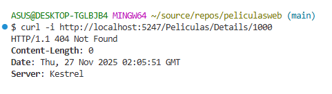
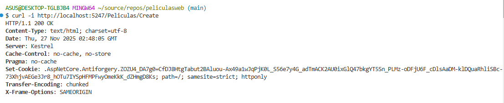
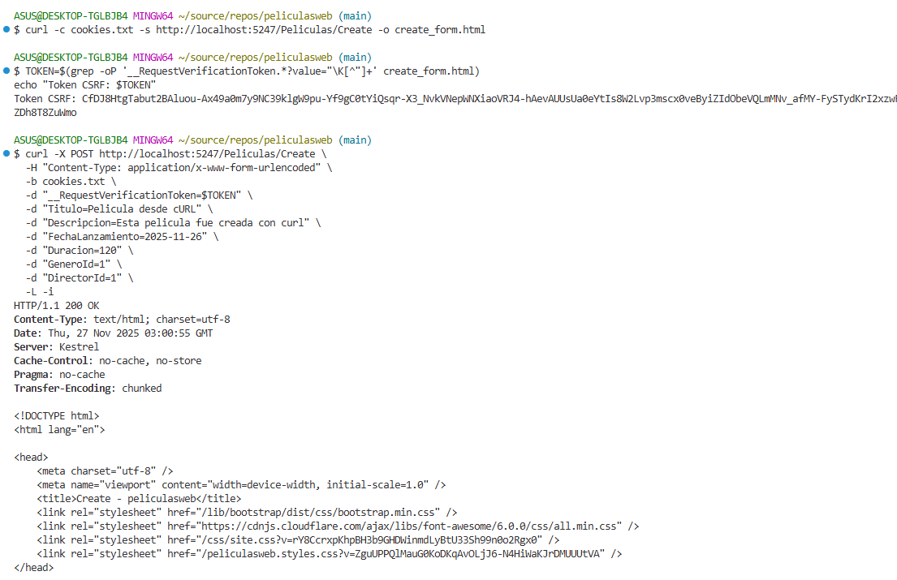

# A1 BROKEN ACCESS CONTROL

👉 [Volver a la narrativa y explicación de pruebas](A1-narrativa.md)

La limitación acá es que no tenemos una forma de hacer login/register directamente.
Aquí analizaremos diferentes pruebas:

- Enumeración de recursos (Insecure Direct Object Reference - IDOR)
- Acceso sin autenticación a operaciones críticas
- Manipulación y eliminación de recursos
- Ataque automatizado de enumeración

---

## Prueba 1: Enumeración de recursos

Ejecutamos un curl para analizar qué tipo de datos nos entrega y observamos que nos devuelve:



Los siguientes headers:

```
HTTP/1.1 200 OK
Content-Type: text/html; charset=utf-8
Date: Thu, 27 Nov 2025 01:57:24 GMT
Server: Kestrel
Transfer-Encoding: chunked
```

¿Qué sucede o qué implica que podamos acceder directamente al id de una película? Puesto que no tenemos directamente un login o register, aún puede ser vulnerable esta app. Al ejecutar un comando de consola que repita estos llamados a diferentes ids, tenemos que los ids válidos tienen una respuesta de 200 y los no válidos o que no existan un 404.



Ahora si observamos que si buscamos un id que no existe realmente no afecta a la página porque devuelve un 404, entonces evitamos que se cruce información de los otros ids, lo cual demuestra una buena prueba de seguridad.



El análisis revela que, aunque el servidor maneja correctamente los recursos inexistentes devolviendo un código 404 y no se observa revelación directa de información sensible en los mensajes de error, existe una vulnerabilidad y es que es posible enumerar todas las películas existentes a través de los códigos de respuesta del servidor (200 para existentes y 404 para inexistentes). Esto permite a un atacante identificar todos los IDs válidos y acceder a recursos sin autorización, lo que representa un riesgo de seguridad significativo. Para mitigar este problema, es fundamental implementar autenticación y validar que los usuarios tengan permiso para acceder a cada recurso.

---

## Prueba 2

Vamos a intentar romper o acceder a la página con el create, vemos que nos envía un ok pero ahora tenemos la cookie entera, es decir si existiese una autenticación capaz un jwt el token quedaría expuesto también.



Ahora si le queremos enviar algo más denso vamos a ver que no nos permite así queramos meter directamente el propio header y sus datos.


Entonces proponemos lo siguiente: enviar al post con un CSRF válido.


