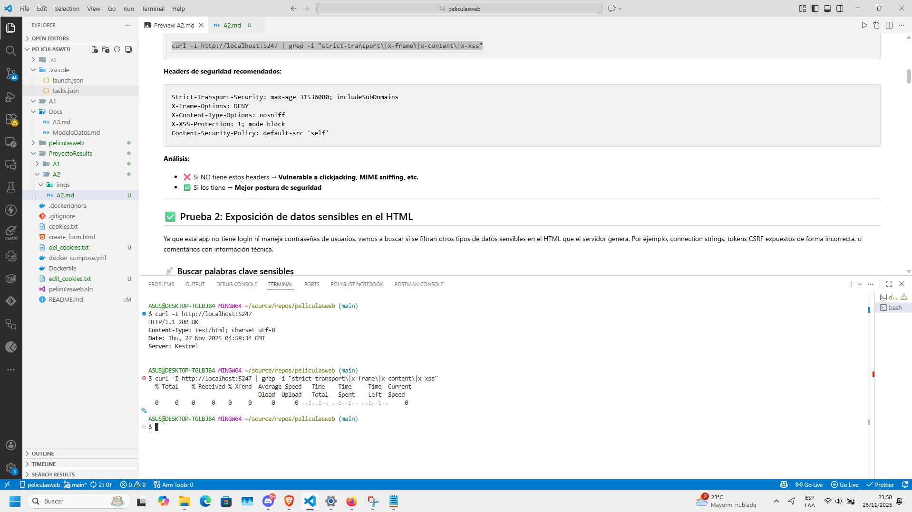
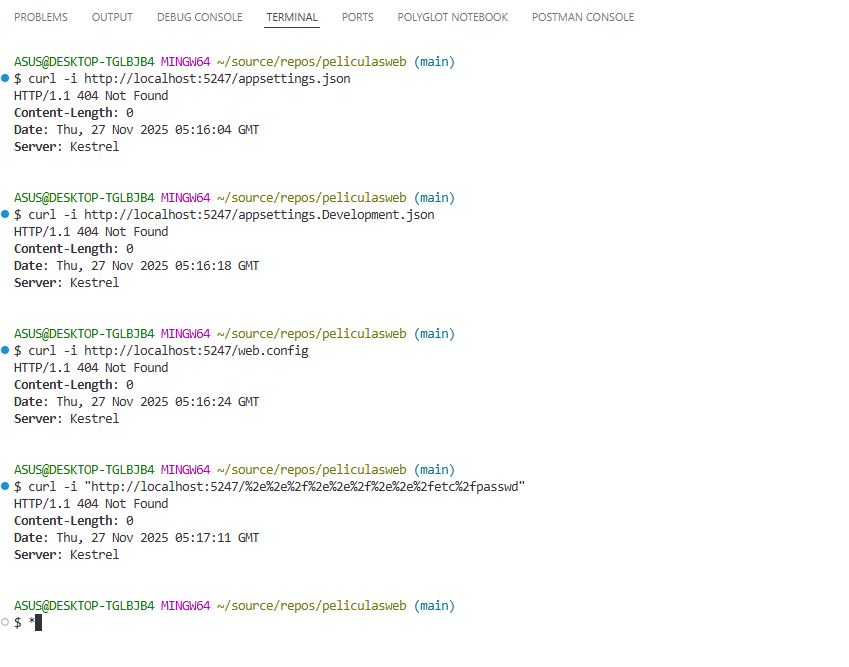
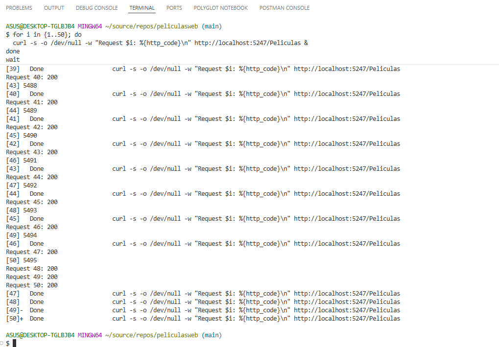

# A2 CRYPTOGRAPHIC FAILURES

👉 [Volver a la narrativa y explicación de pruebas](A2-narrativa.md)

Como la app no tiene sistema de login/register, las pruebas se enfocan en la configuración de seguridad básica: HTTPS, headers, exposición de datos sensibles, archivos de configuración y rate limiting.

Aquí analizaremos diferentes pruebas:

- Verificar uso de HTTPS y headers de seguridad
- Exposición de datos sensibles en el HTML
- Búsqueda de archivos sensibles expuestos
- Rate Limiting y DoS básico

---

## Prueba 1: Verificar uso de HTTPS y headers de seguridad

Primero ejecutamos un curl para ver qué headers devuelve el servidor y si tiene configurados los headers de seguridad recomendados.



Como era de esperar, en desarrollo estamos usando HTTP (localhost), lo cual es normal. Pero lo que sí se nota es que no hay headers de seguridad como `X-Frame-Options`, `X-Content-Type-Options`, `Strict-Transport-Security`, etc.

Esto no es crítico en desarrollo, pero en producción sería un problema porque deja la app vulnerable a ataques como clickjacking, MIME sniffing, y otros.

**Conclusión:** Los headers de seguridad no están configurados. Esto es algo que hay que arreglar antes de llevar la app a producción.

---

## Prueba 2: Exposición de datos sensibles en el HTML

Para esta prueba descargamos el HTML de la página principal y de películas para revisarlo manualmente y ver si hay datos sensibles filtrados.


Al abrir los archivos descargados y buscar palabras clave como "password", "secret", "connection", "server=", no encontramos nada sospechoso. El HTML está limpio, solo tiene el contenido normal de la página y los tokens CSRF bien implementados.

**Conclusión:** No hay exposición de datos sensibles en el HTML. La app está bien configurada en este aspecto.

---

## Prueba 3: Búsqueda de archivos sensibles expuestos

Ahora intentamos acceder a archivos de configuración que deberían estar protegidos, como `appsettings.json`, `web.config`, `.env`, etc.



Como se ve en la imagen, todos los intentos de acceder a archivos sensibles devolvieron 404. Esto es correcto, porque ASP.NET Core protege por defecto estos archivos y no permite acceso directo desde el navegador.

También probamos path traversal para intentar acceder a archivos del sistema operativo, y todos fueron rechazados con 404 o 400.

**Conclusión:** Los archivos sensibles están bien protegidos. No es posible acceder a configuraciones ni hacer path traversal.

---

## Prueba 4: Rate Limiting y DoS básico

Para cerrar, probamos si la app tiene algún tipo de protección contra ataques de fuerza bruta o denegación de servicio, enviando múltiples requests simultáneos.



Como se ve, todos los 50 requests fueron procesados sin problema, todos devolvieron 200 OK. Esto significa que no hay rate limiting configurado.

Aunque no es crítico para una app de desarrollo sin datos sensibles, en producción esto podría permitir:

- Scraping masivo de información
- Sobrecarga del servidor (DoS)
- Enumeración rápida de recursos

**Conclusión:** No hay rate limiting. Es recomendable implementarlo antes de producción.

---

## 🛠️ Soluciones propuestas

Después de analizar todas las pruebas, estas son las soluciones recomendadas:

### 1. Forzar HTTPS en producción

```csharp
// En Program.cs
if (!app.Environment.IsDevelopment())
{
    app.UseHttpsRedirection();
    app.UseHsts();
}
```

### 2. Agregar headers de seguridad

```csharp
// En Program.cs (después de var app = builder.Build();)
app.Use(async (context, next) =>
{
    context.Response.Headers.Add("X-Content-Type-Options", "nosniff");
    context.Response.Headers.Add("X-Frame-Options", "DENY");
    context.Response.Headers.Add("X-XSS-Protection", "1; mode=block");
    context.Response.Headers.Add("Referrer-Policy", "no-referrer");
    context.Response.Headers.Add("Content-Security-Policy", "default-src 'self'");
    await next();
});
```

### 3. Implementar Rate Limiting

```csharp
// En Program.cs
using Microsoft.AspNetCore.RateLimiting;

builder.Services.AddRateLimiter(options =>
{
    options.AddFixedWindowLimiter("fixed", opt =>
    {
        opt.PermitLimit = 100;
        opt.Window = TimeSpan.FromMinutes(1);
        opt.QueueProcessingOrder = QueueProcessingOrder.OldestFirst;
        opt.QueueLimit = 0;
    });
});

// Después de var app = builder.Build();
app.UseRateLimiter();
```

Y en los controladores:

```csharp
[EnableRateLimiting("fixed")]
public class PeliculasController : Controller
{
    // ... acciones del controlador
}
```

### 4. Ocultar información detallada de errores en producción

```csharp
// En Program.cs
if (app.Environment.IsDevelopment())
{
    app.UseDeveloperExceptionPage();
}
else
{
    app.UseExceptionHandler("/Home/Error");
    // No mostrar stack traces en producción
}
```

Con estas medidas, la app estará mejor preparada para producción y reduciremos significativamente la superficie de ataque.
