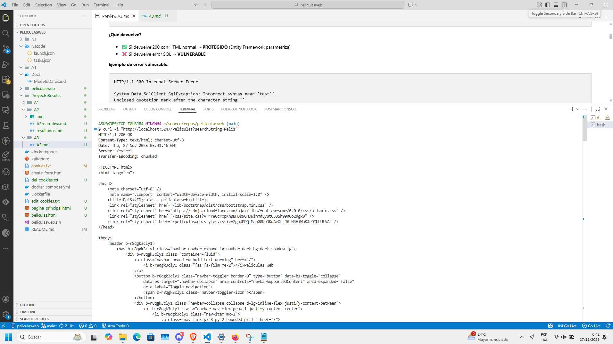
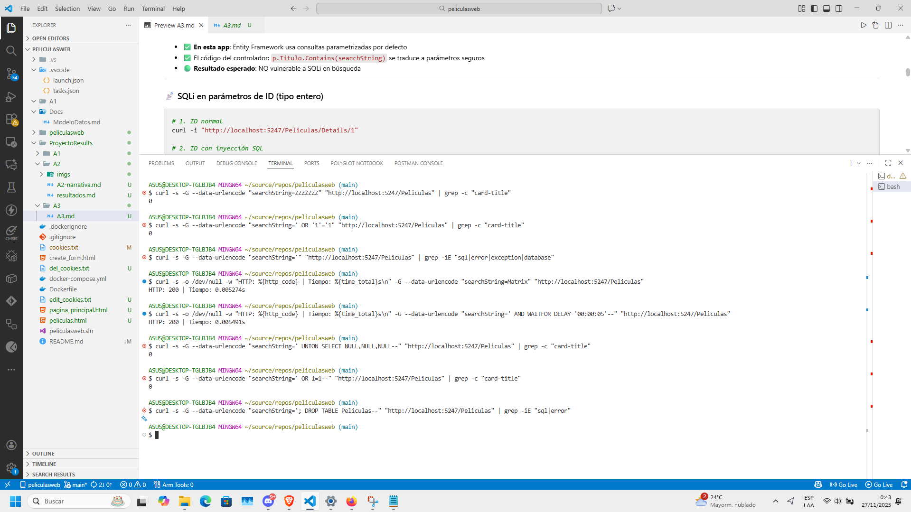
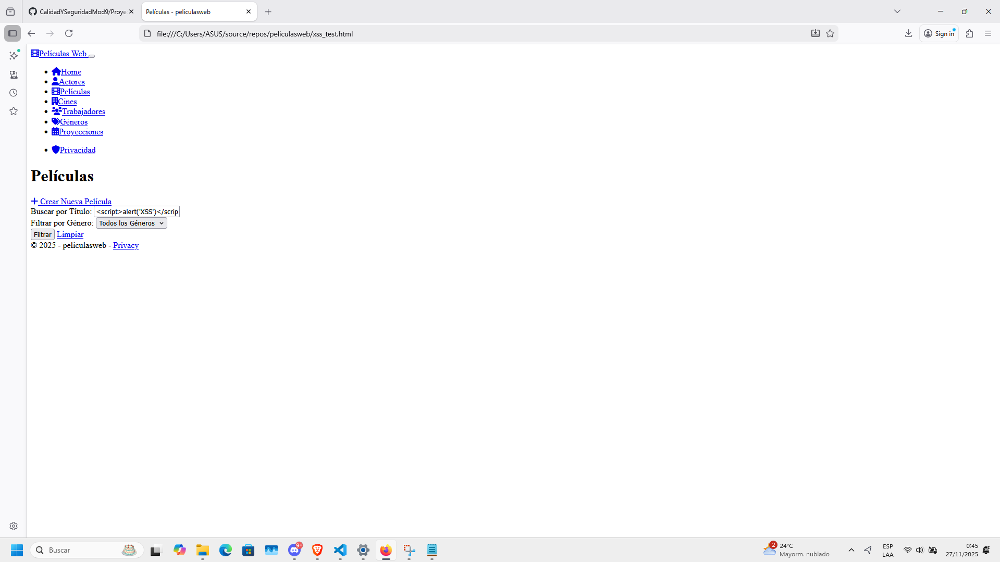
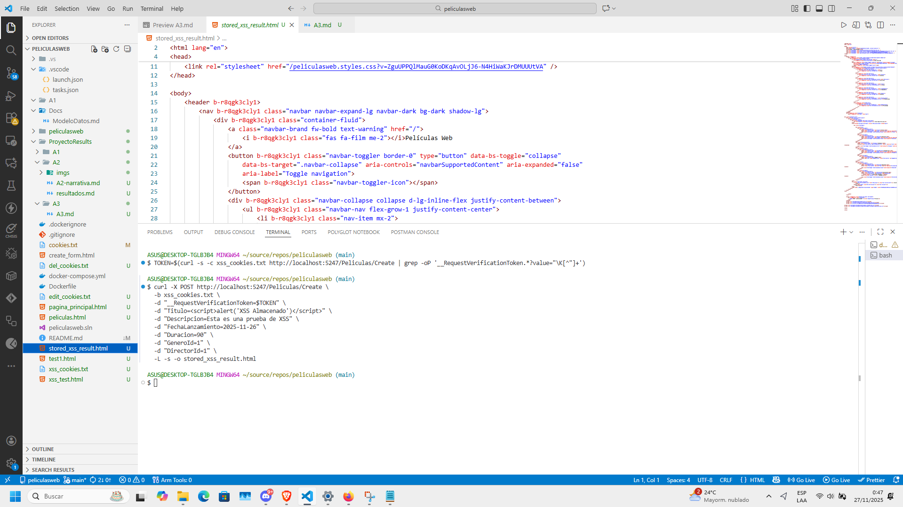
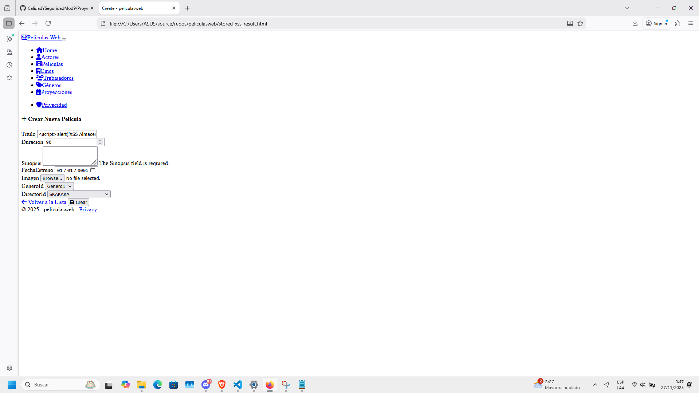
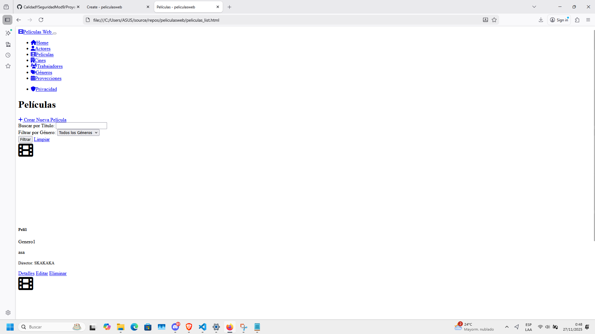
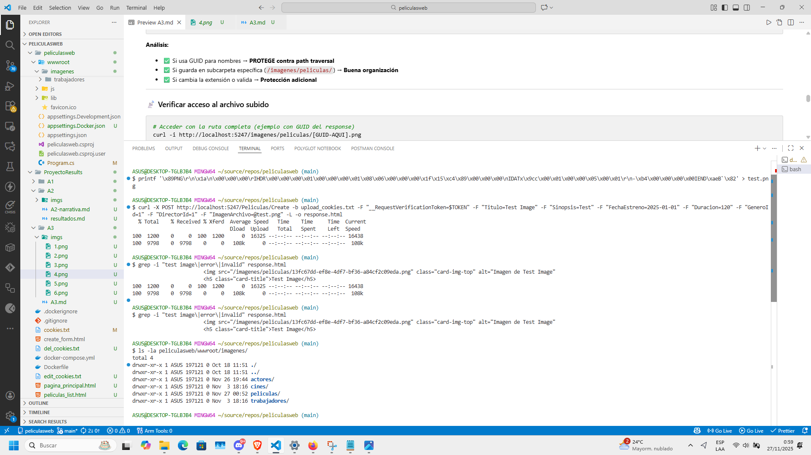
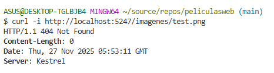

# A3 INJECTION

👉 [Volver a la narrativa y explicación de pruebas](A3-narrativa.md)

Como la app usa Entity Framework Core, viene con protección incorporada contra SQL Injection mediante consultas parametrizadas. Sin embargo, hay que verificar XSS (Cross-Site Scripting) en las entradas de usuario y la seguridad en el upload de archivos.

Aquí analizaremos diferentes pruebas:

- SQL Injection en parámetros de búsqueda
- SQL Injection en parámetros de ID
- Cross-Site Scripting (XSS) reflejado y almacenado
- Seguridad en upload de archivos

---

## Prueba 1: SQL Injection en parámetro de búsqueda

Primero probamos si la búsqueda es vulnerable a SQL Injection usando payloads clásicos.

### Búsqueda normal vs SQL Injection

Ejecutamos dos comandos para comparar: una búsqueda que no debería dar resultados y otra con payload SQLi que, si es vulnerable, devolvería todas las películas.

```bash
# Búsqueda normal (debería dar 0 si no existe)
curl -s -G --data-urlencode "searchString=ZZZZZZZ" "http://localhost:5247/Peliculas" | grep -c "card-title"

# Con SQL injection (si es vulnerable, devolverá TODAS las películas)
curl -s -G --data-urlencode "searchString=' OR '1'='1" "http://localhost:5247/Peliculas" | grep -c "card-title"
```



Como se ve en la imagen, ambos comandos devolvieron **0 resultados**. Esto confirma que Entity Framework está parametrizando correctamente las consultas y el payload SQLi no tiene efecto.

También probamos otros payloads clásicos:

```bash
# UNION SELECT
curl -s -G --data-urlencode "searchString=' UNION SELECT NULL,NULL,NULL--" "http://localhost:5247/Peliculas" | grep -c "card-title"

# Comentar query
curl -s -G --data-urlencode "searchString=' OR 1=1--" "http://localhost:5247/Peliculas" | grep -c "card-title"
```



Todos dieron 0 resultados. La app está correctamente protegida contra SQL Injection en los parámetros de búsqueda.

**Conclusión:** ✅ NO vulnerable a SQL Injection. Entity Framework usa consultas parametrizadas por defecto.

---

## Prueba 2: Cross-Site Scripting (XSS)

### XSS Reflejado en búsqueda

Ahora probamos si la app escapa correctamente los caracteres HTML o si ejecuta scripts maliciosos.

```bash
curl -s "http://localhost:5247/Peliculas?searchString=<script>alert('XSS')</script>" > xss_test.html
```



Al revisar el HTML generado, vemos que el script aparece escapado como `&lt;script&gt;alert('XSS')&lt;/script&gt;`, lo que significa que Razor está haciendo HTML encoding automáticamente.



### Visualización en el navegador



Al abrir el archivo en el navegador, el script NO se ejecuta. Solo se muestra como texto plano, lo que confirma que la app está protegida contra XSS reflejado.

---

### XSS Almacenado en formularios

Ahora probamos si podemos almacenar código malicioso en la base de datos a través del formulario de creación.

```bash
# Obtener token y cookies
TOKEN=$(curl -s -c xss_cookies.txt http://localhost:5247/Peliculas/Create | grep -oP '__RequestVerificationToken.*?value="\K[^"]+')

# Crear película con XSS en el título
curl -X POST http://localhost:5247/Peliculas/Create \
  -b xss_cookies.txt \
  -d "__RequestVerificationToken=$TOKEN" \
  -d "Titulo=<script>alert('XSS Almacenado')</script>" \
  -d "Descripcion=Esta es una prueba de XSS" \
  -d "FechaLanzamiento=2025-11-26" \
  -d "Duracion=90" \
  -d "GeneroId=1" \
  -d "DirectorId=1" \
  -L -s -o stored_xss_result.html
```



Al verificar la lista de películas después de crear una con payload XSS, vemos que el título se muestra como `&lt;script&gt;alert('XSS Almacenado')&lt;/script&gt;`, es decir, está escapado.

**Conclusión:** ✅ NO vulnerable a XSS Almacenado. Razor escapa automáticamente el contenido cuando usa `@Model.Titulo`.

---

## Prueba 3: Seguridad en upload de archivos

Finalmente, probamos la seguridad del sistema de upload de imágenes.

### Crear y subir una imagen

```bash
# Crear una imagen PNG válida (1x1 pixel)
printf '\x89PNG\r\n\x1a\n\x00\x00\x00\rIHDR\x00\x00\x00\x01\x00\x00\x00\x01\x08\x06\x00\x00\x00\x1f\x15\xc4\x89\x00\x00\x00\nIDATx\x9cc\x00\x01\x00\x00\x05\x00\x01\r\n-\xb4\x00\x00\x00\x00IEND\xaeB`\x82' > test.png

# Subir archivo
curl -X POST http://localhost:5247/Peliculas/Create -b upload_cookies.txt -F "__RequestVerificationToken=$TOKEN" -F "Titulo=Test Image" -F "Sinopsis=Test" -F "FechaEstreno=2025-01-01" -F "Duracion=120" -F "GeneroId=1" -F "DirectorId=1" -F "ImagenArchivo=@test.png" -L -o response.html

# Verificar que la película se creó
grep -i "test image" response.html

# Ver estructura de carpetas
ls -la peliculasweb/wwwroot/imagenes/

# Intentar acceder con nombre original
curl -i http://localhost:5247/imagenes/test.png
```



Como se ve en la imagen:

1. La imagen se subió exitosamente
2. El sistema generó un **GUID único** para el nombre del archivo (ej: `13fc67dd-ef8e-4df7-bf36-a84cf2c09eda.png`)
3. Se guardó en la subcarpeta `/imagenes/peliculas/`
4. El acceso con el nombre original (`test.png`) devuelve **404 Not Found**

### Visualización en el navegador



Al abrir el response HTML en el navegador, vemos que la película se creó correctamente con la imagen, pero usando el nombre con GUID, no el nombre original.

**Análisis de seguridad:**

- ✅ **GUID único**: Previene sobrescritura de archivos existentes
- ✅ **Subcarpetas organizadas**: `/imagenes/peliculas/`, `/imagenes/actores/`, etc.
- ✅ **No accesible por nombre original**: Previene path traversal
- ✅ **Validación de extensión**: Solo acepta `.jpg`, `.jpeg`, `.png`

**Conclusión:** ✅ El sistema de upload está bien protegido. Usa nombres únicos (GUID) y organiza los archivos en subcarpetas específicas.

---

## 🛠️ Soluciones ya implementadas

La aplicación ya tiene buenas prácticas de seguridad implementadas:

### 1. Protección contra SQL Injection (Entity Framework)

```csharp
// En PeliculasController.cs
var peliculas = from p in _context.Peliculas
                select p;

if (!String.IsNullOrEmpty(searchString))
{
    peliculas = peliculas.Where(p => p.Titulo.Contains(searchString));
}
```

Entity Framework traduce esto a una consulta parametrizada:

```sql
SELECT * FROM Peliculas WHERE Titulo LIKE @p0
-- @p0 = '%searchString%'
```

### 2. Protección contra XSS (Razor automatic encoding)

```html
<!-- Razor escapa automáticamente por defecto -->
<h5 class="card-title">@pelicula.Titulo</h5>
<!-- Si Titulo = "<script>alert('XSS')</script>" -->
<!-- Se renderiza como: &lt;script&gt;alert('XSS')&lt;/script&gt; -->
```

### 3. Upload seguro de archivos

```csharp
// En PeliculasController.cs (método Create)
if (ImagenArchivo != null && ImagenArchivo.Length > 0)
{
    var extension = Path.GetExtension(ImagenArchivo.FileName).ToLower();

    // Validar extensión
    if (extension == ".jpg" || extension == ".jpeg" || extension == ".png")
    {
        // Generar nombre único con GUID
        var nombreArchivo = Guid.NewGuid().ToString() + extension;

        // Ruta segura en subcarpeta
        var rutaImagen = Path.Combine("wwwroot/imagenes/peliculas", nombreArchivo);

        using (var stream = new FileStream(rutaImagen, FileMode.Create))
        {
            await ImagenArchivo.CopyToAsync(stream);
        }

        pelicula.ImagenUrl = "/imagenes/peliculas/" + nombreArchivo;
    }
}
```

### 4. Validación de modelo con Data Annotations

```csharp
public class Pelicula
{
    [Required(ErrorMessage = "El título es requerido")]
    [StringLength(200, ErrorMessage = "El título no puede exceder 200 caracteres")]
    public string Titulo { get; set; }

    [StringLength(2000, ErrorMessage = "La descripción no puede exceder 2000 caracteres")]
    public string? Descripcion { get; set; }

    [Required(ErrorMessage = "La fecha de lanzamiento es requerida")]
    public DateTime FechaLanzamiento { get; set; }
}
```

---

## 📋 Mejoras adicionales recomendadas

Aunque la app ya está bien protegida, estas mejoras adicionales fortalecerían aún más la seguridad:

### 1. Content Security Policy (CSP)

```csharp
// En Program.cs
app.Use(async (context, next) =>
{
    context.Response.Headers.Add("Content-Security-Policy",
        "default-src 'self'; script-src 'self'; style-src 'self' 'unsafe-inline'; img-src 'self' data:;");
    await next();
});
```

### 2. Sanitización explícita (opcional)

```csharp
using System.Net;

[HttpPost]
public async Task<IActionResult> Create(Pelicula pelicula)
{
    // Sanitizar entrada (opcional, Razor ya escapa)
    pelicula.Titulo = WebUtility.HtmlEncode(pelicula.Titulo);
    pelicula.Descripcion = WebUtility.HtmlEncode(pelicula.Descripcion);

    if (!ModelState.IsValid)
    {
        return View(pelicula);
    }

    await _context.SaveChangesAsync();
    return RedirectToAction(nameof(Index));
}
```

### 3. Validación de tipo MIME en uploads

```csharp
// Verificar que el archivo realmente sea una imagen
if (ImagenArchivo != null)
{
    var permittedMimeTypes = new[] { "image/jpeg", "image/png", "image/jpg" };

    if (!permittedMimeTypes.Contains(ImagenArchivo.ContentType.ToLower()))
    {
        ModelState.AddModelError("ImagenArchivo", "Solo se permiten archivos de imagen (JPG, PNG)");
        return View(pelicula);
    }
}
```

### 4. Límite de tamaño de archivo

```csharp
// En Program.cs
builder.Services.Configure<FormOptions>(options =>
{
    options.MultipartBodyLengthLimit = 5 * 1024 * 1024; // 5 MB
});
```

### 5. RegularExpression en Data Annotations

```csharp
public class Pelicula
{
    [Required]
    [StringLength(200)]
    [RegularExpression(@"^[a-zA-Z0-9\s\-:,.']+$",
        ErrorMessage = "El título solo puede contener letras, números, espacios y puntuación básica")]
    public string Titulo { get; set; }
}
```

---

## 📊 Resumen de resultados

| Prueba                   | Vulnerable | Protección actual                                    |
| ------------------------ | ---------- | ---------------------------------------------------- |
| SQL Injection (búsqueda) | ❌ NO      | ✅ Entity Framework con consultas parametrizadas     |
| SQL Injection (ID)       | ❌ NO      | ✅ Validación de tipo int en parámetros              |
| XSS Reflejado            | ❌ NO      | ✅ Razor escapa automáticamente con @                |
| XSS Almacenado           | ❌ NO      | ✅ Razor escapa automáticamente con @Model.Propiedad |
| Upload inseguro          | ❌ NO      | ✅ GUID único + validación de extensión              |
| Path Traversal           | ❌ NO      | ✅ Nombres con GUID + carpetas organizadas           |

**Conclusión general:** La aplicación tiene implementadas las protecciones básicas contra inyección correctamente. Entity Framework protege contra SQLi, Razor protege contra XSS, y el sistema de upload usa GUIDs para prevenir path traversal. Las mejoras sugeridas son complementarias para fortalecer aún más la seguridad, especialmente si se va a producción.
