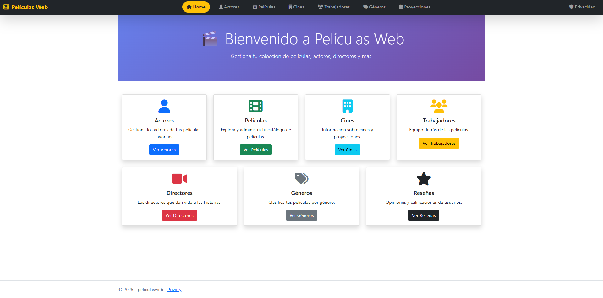

# PeliculasWeb - Pruebas de Seguridad OWASP



## 📚 Documentación de Pruebas

- [A1: Narrativa del laboratorio](ProyectoResults/A1/A1-narrativa.md)
- [A1: Resultados y evidencias](ProyectoResults/A1/resultados.md)
- [A2: Narrativa del laboratorio](ProyectoResults/A2/A2-narrativa.md)
- [A2: Resultados y evidencias](ProyectoResults/A2/resultados.md)
- [A3: Narrativa del laboratorio](ProyectoResults/A3/A3-narrativa.md)
- [A3: Resultados y evidencias](ProyectoResults/A3/resultados.md)

---

## 🎯 ¿De qué va esto?

Este es el proyecto del **Módulo 8 de Backend Pro Tools** (una aplicación web ASP.NET Core MVC con SQL Server para gestionar películas, actores, cines y demás). Como era un buen proyecto funcional, decidí usarlo para hacer **pruebas de seguridad** siguiendo el OWASP Top 10 (específicamente A1, A2 y A3).

La idea no era armar un laboratorio súper formal ni nada por el estilo, sino más bien **encontrar una forma práctica de identificar vulnerabilidades** en mi propio sistema usando lo que tenía a mano: básicamente **terminal y curl** en Git Bash (MINGW64), porque no tengo herramientas como Burp Suite Pro, SonarQube o OWASP ZAP instaladas.

### ¿Por qué este proyecto?

Como el proyecto usa el **template MVC de ASP.NET Core**, ya viene con muchas protecciones por defecto (Entity Framework que parametriza consultas, Razor que escapa HTML automáticamente, validación de tipos, etc.). Esto hace que **buscar vulnerabilidades sea más complicado**, porque Microsoft ya implementó buenas prácticas de seguridad desde el inicio.

Aún así, quería ver:

- ¿Qué tan seguro es realmente?
- ¿Se puede romper con técnicas básicas de hacking?
- ¿Qué pasa si intento inyección SQL, XSS, enumeración de recursos, etc.?
- ¿Cómo documento todo esto de forma clara?

---

## 🔒 ¿Qué probé?

Me enfoqué en las tres primeras categorías del **OWASP Top 10 (2021)**:

### **A1: Broken Access Control** (Control de Acceso Roto)

Básicamente probé si podía acceder a recursos que no debería, enumerar IDs, ver detalles de otras películas/actores sin autorización, etc.

### **A2: Cryptographic Failures** (Fallos Criptográficos)

Revisé si había datos sensibles expuestos, si faltaban headers de seguridad, si los archivos de configuración eran accesibles, si había rate limiting, etc.

### **A3: Injection** (Inyección)

Intenté SQL Injection en búsquedas y parámetros, Cross-Site Scripting (XSS) en formularios, y verifiqué la seguridad del sistema de upload de archivos.

---

## 🛠️ ¿Cómo hice las pruebas?

Todo desde **terminal con curl** porque no tenía acceso a herramientas más avanzadas. Usé:

- **curl**: Para hacer requests HTTP GET/POST, probar payloads, descargar respuestas
- **grep**: Para buscar patrones en las respuestas HTML
- **bash**: Para automatizar algunas pruebas con loops
- **Navegador**: Solo para verificar visualmente algunas cosas

La documentación en `ProyectoResults/` tiene los comandos exactos que ejecuté, las respuestas que obtuve, y capturas de pantalla de todo el proceso.

---

## 📂 Estructura del proyecto

- **`/peliculasweb/`** → Código fuente ASP.NET Core MVC
- **`/ProyectoResults/`** → Documentación de pruebas (narrativas y resultados con imágenes)
  - **`/A1/`** → Broken Access Control
  - **`/A2/`** → Cryptographic Failures
  - **`/A3/`** → Injection
- **`Main.png`** → Captura de la página principal de la app

---

## ⚡ ¿Cómo ejecutar el proyecto?

```bash
# Clonar el repo
git clone <repo-url>

# Entrar a la carpeta del proyecto
cd peliculasweb/peliculasweb

# Ejecutar la app
dotnet run

# Acceder en el navegador
# http://localhost:5247
```

Una vez corriendo, puedes revisar los comandos en las narrativas de `ProyectoResults/` y ejecutarlos tú mismo para reproducir las pruebas.

---

## 📊 Resultados generales

Después de todas las pruebas, la conclusión es que **el template de ASP.NET Core MVC es bastante seguro por defecto**:

- ✅ **No vulnerable a SQL Injection** (Entity Framework parametriza)
- ✅ **No vulnerable a XSS** (Razor escapa HTML automáticamente)
- ✅ **Upload de archivos seguro** (usa GUIDs y valida extensiones)
- ⚠️ **Falta configuración de producción** (headers de seguridad, rate limiting, HTTPS forzado)

Las vulnerabilidades encontradas fueron principalmente **de configuración** (falta de headers de seguridad, no hay rate limiting, desarrollo sin HTTPS), no problemas de código. Esto es normal porque el proyecto está en modo desarrollo, pero hay que ajustarlo antes de producción.

---

## 📖 Para revisar las pruebas completas

Entra a la carpeta **`ProyectoResults/`** y revisa cada categoría (A1, A2, A3). Ahí encontrarás:

- **Narrativa**: Explicación de qué probé y cómo
- **Resultados**: Los comandos exactos que ejecuté, las respuestas obtenidas, capturas de pantalla y conclusiones
- **Soluciones**: Código para mitigar las vulnerabilidades encontradas

Todo está documentado paso a paso con los comandos reales que usé en Git Bash.
